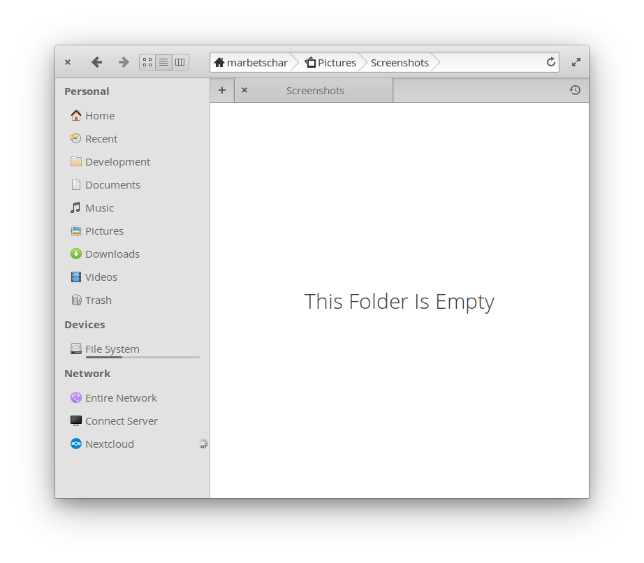

# Nextcloud Client


These steps document how to install the Nextcloud client on elementary OS 5.1 Hera - including Cloud Providers support in Files:



**PLEASE NOTE:** At the time of writing (2020-01-15) Cloud Providers integration did not work out of the box due to [a Pull Request not merged yet](https://github.com/nextcloud/desktop/pull/1729). To fix this, see the [Troubleshooting section below](#troubleshooting)

## 1. Add Nextcloud client PPA

You need to add the Nextcloud client PPA to enable your elementary OS to actually find the needed packages.
For this, open a Terminal and insert the following commands:

```
sudo add-apt-repository ppa:nextcloud-devs/client
sudo apt-get update
```

For more details see [the PPA's homepage](https://launchpad.net/~nextcloud-devs/+archive/ubuntu/client).

## 2. Install Nextcloud client

*Don't worry, you only need to install Nextcloud client via Terminal - future updates will be handled graphically by the elementary OS AppCenter.*

We are now ready to install the client. To do so, enter the following commands in your Terminal:

```
sudo apt install nextcloud-client
```

And that's it. You successfully installed Nextcloud client on elementary OS. Start it up and configure it. Once you fully configured it, you'll fall in love with its integration into elementary's File Manager.

# Troubleshooting

## Nextcloud integration does not appear in Files

Until [this Pull Request is merged](https://github.com/nextcloud/desktop/pull/1729) and a new Nextcloud client release is ready, you need to create the following two files manually. Before you do so, make sure the needed paths exist, by executing the following command:

```
sudo mkdir -p /usr/share/cloud-providers
```

And now let's add the files:

**/usr/share/cloud-providers/com.nextcloudgmbh.Nextcloud.ini**

```
[Cloud Providers]
BusName=com.nextcloudgmbh.Nextcloud
ObjectPath=/com/nextcloudgmbh/Nextcloud
Version=1
```

**/usr/share/dbus-1/services/com.nextcloudgmbh.Nextcloud.service**

```
[D-BUS Service]
Name=com.nextcloudgmbh.Nextcloud
Exec=nextcloud
```

Once done, simply reopen Files and you should see the Nextcloud Cloud Provider integration in the lower left corner.